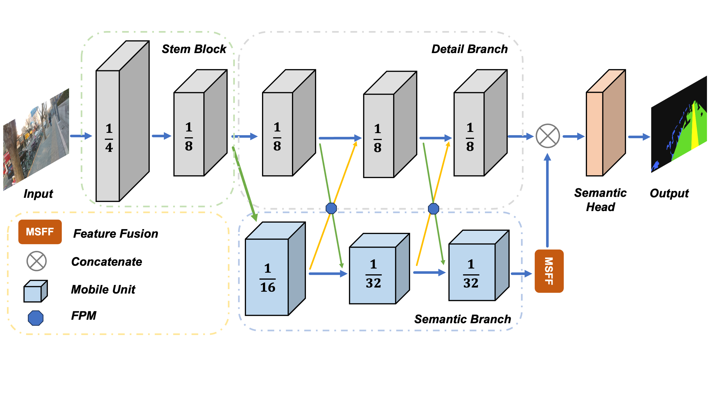

# Lightweight Road Image Segmentation Algorithm Based on Multi-scale Feature Fusion

## Introduction

This paper proposed an efficient road image segmentation algorithm based on multi-scale features. Unlike the existing methods, the introduced model contains two feature extraction branches, namely the Detail Branch and the Semantic Branch. The Detail Branch extracts low-level detail information from the image, while the Semantic Branch extracts high-level semantic information. Then, these extracted multi-scale features from each branch are also fused, which can further improve the model's performance. In addition, we designed a simple and efficient feature fusion module to enhance the model's ability to encode contextual information by fusing multi-scale features. We collected and labeled a large amount of road segmentation data suitable for blind-guiding scenarios and made a corresponding data set. We conduct extensive experiments on the proposed dataset. The experimental results show that the mIoU of the proposed method is 96.5%, which is better than the existing complex models. The structure of our proposed method is shown as follow. 




## Mian Results

We conduct extensive experiments on our collected dataset. The model performance was evaluated using **mIoU**. Results are shown as follow:

| Method | Time | Backbone | MIoU (%) | Param (M) | 
|--------|----------|-----------|--------|----------| 
| ENet | 2016 | - | 73.3 | 0.6 |
| ICNet | 2018 | PSPNet | 80.2 | 26.5 |
| DeepLabV3+ | 2018 | ResNet-101 | 96.3 | 62.7 |
| ESPNetV2 | 2019 | ESPNet | 76.5 | 0.5 |
| BiSeNetV2 | 2021 |  - | 94.2 | 47.1 | 
| RTFormer | 2022 | - | 96.9 | 17.3 |
| U-HRNet | 2022 | U-HRW-48 | 97.1 | 132.0 |
| MobileSeg | 2023 | StrideFormer | 92.2 | 5.7 |
| EMSeg-T | - | - | 91.9 | 5.6 |
| EMSeg-M | - | - | 96.5 | 36.5 |


## Environment

- The code is developed using python 3.10 on Ubuntu 20.04.
- The proposed method should be trained and validated in GPU.
- If you want to train the proposed segmentation method on custom dataset, Nvidia GPUs are needed. 
- This code is development and tested using one Nvidia A100 GPU with 80GB memory.  


## Quick start

### Installation

1. Clone this repo:
   ```
   git clone https://github.com/syysha0k/VisNavi
   ```

2. Install dependencies:
   ```
   pip install -r requirements.txt
   ```

### Model training and validation

- Training:
    ```
    python main.py --model emseg_tiny --vis --device_id 0 --epoches 300 --crop_val --lr 0.01 --crop_size 1024 --batch_size 64 
    ```

- Test:
    ```
    python main.py --model emseg_tiny --vis --device_id 0 --crop_val --crop_size 1024 --batch_size 16 --weight checkpoint/best.pt --test_only --save_path exp/10/test_01
    ```

- Predict:
    ```
    python predict.py --input datasets/test_01.png --model emseg_tiny --weight checkpoint/best.pt --save_path exp/10/pred_01
    ```


